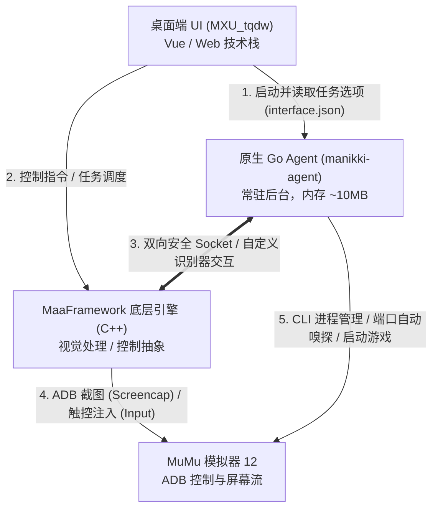

# MaNikki4 核心系统架构详解

本项目结合了 **MaaFramework 图像自动化推理核心**、**原生 Go 常驻 Agent 进程** 与 **定制化桌面端 UI (MXU)**，实现了高稳定性、高响应、极低占用的日常自动化控制。

---

## 1. 总体分层架构



### 各层职责划分
1. **用户交互层 (UI - `MXU_tqdw`)**：
   * 负责用户界面的呈现、任务勾选、预设配置切换与选项参数输入。
   * 入口 Schema 由 `assets/interface.json` 定义。
2. **应用调度层 (Agent - `agent/`)**：
   * 纯 Go 1.24+ 编写，脱离 Python 运行时，体积轻巧（编译产物 ~15MB，运行内存仅 10MB）。
   * 提供模拟器路径探测、无感拉起与状态维护。
   * 提供竞技场战力计算与挑选对手业务逻辑。
   * 注册 `MatchRowButton` 等自定义识别扩展，与底层 C++ 视觉引擎无缝协同。
3. **底层执行引擎 (Core - `MaaFramework`)**：
   * 负责 ADB 连接建立、高帧率图像捕获、PP-OCR 文字识别与模板匹配。
   * 解析执行 `assets/resource/pipeline/*.json` 中定义的有限状态机（FSM）任务流水线。

---

## 2. 原生 Go Agent 内部模块解构

Go Agent 源码全部位于 `agent/` 目录中：

```
agent/
├── cmd/
│   └── manikki-agent/          # 主程序入口 (main.go)
└── internal/
    ├── agentserver/            # Agent 生命周期与 MaaFramework Socket 服务注册
    │   ├── registry.go         # 注册自定义识别器/动作/控制器到 MaaFramework
    │   └── server.go           # Socket 通信连接与命令派发
    ├── arena/                  # 竞技场自动挑对手与战力比对模块
    │   └── checker.go          # 战力数值 OCR 提取、防守战力比对、金币换一批决策
    ├── emulator/               # MuMu 模拟器管理模块
    │   ├── emulator.go         # 注册表与默认路径嗅探、MuMu CLI 进程启动、ADB 端口监听
    │   └── emulator_test.go    # 单元测试
    ├── matcher/                # 自研自定义视觉匹配组件
    │   ├── row_button.go       # MatchRowButton 核心算法实现
    │   └── row_button_test.go  # 单元测试
    └── runtimepath/            # 运行时路径自适应嗅探
        └── runtimepath.go      # 支持在源码根目录与 install 安装目录下无感运行
```

### 关键组件原理

#### 1. `MatchRowButton`（行级容差动态按钮对齐）
* **背景痛点**：在材料列表、联盟列表等界面中，多行图文并列排列，且支持滚动。硬编码坐标在分辨率缩放或列表顺序发生微小变动时极其脆弱。
* **算法实现**（`agent/internal/matcher/row_button.go`）：
  1. 在给定的矩形 ROI（Region of Interest）内触发 OCR，获取所有文本识别框；
  2. 提取符合关键词规则（支持正则，如 `主线|卷|关卡`、`时空回廊`、`服装店|商店`）的候选框中心坐标 $(X_{kw}, Y_{kw})$；
  3. 提取操作按钮候选框（如“前往”、“购买”）中心坐标 $(X_{btn}, Y_{btn})$；
  4. 判定水平高度约束：
     $$\Delta Y = |Y_{btn} - Y_{kw}| \le \text{tolerance}$$
     且按钮位于文字的右侧（$X_{btn} > X_{kw}$）；
  5. 命中后将按钮坐标返回作为点击目标，完成精准行对齐操作。

#### 2. `Emulator` 模拟器自愈与自动化拉起
* **路径嗅探**：通过 Windows 注册表和常见安装目录（如 `D:\MuMuPlayer-12.0\`、`C:\Program Files\Netease\MuMuPlayer-12.0\`）自适应探测 MuMu 安装路径；
* **ADB 控制**：通过 MuMu 的 `MuMuManager.exe` 命令行启动实例，等待 ADB 守护端口就绪（如 `127.0.0.1:16384` 等）；
* **游戏直启**：通过 ADB Shell `monkey -p com.papegames.nn4.cn -c android.intent.category.LAUNCHER 1` 直达游戏进程，免去桌面图标点击。

---

## 3. 视觉感知协作模式

系统采用 **OCR 语义理解为主，模板特征匹配为辅** 的协作感知模型：

```
[屏幕输入图像]
       │
       ├─► [PP-OCR v4/v5 离线轻量模型] ──► 识别关卡名、剩余次数、战力数值、材料名、按钮文本
       │                                     └─► 结合正则表达式与动态容差，抗文案微调
       │
       └─► [Template Matching 模板匹配] ──► 识别无文字纯图标（返回上一页左箭头、右上角粉钻）
                                             └─► 绿色掩码 (#00FF00) 屏蔽背景光效干扰
```

* **极简资产库**：当前全项目仅需维护 2 张核心图片模板：
  * `assets/resource/image/闪暖-返回箭头.png`：跨界面通用回退导航；
  * `assets/resource/image/粉钻.png`：独立分享界面粉钻领取图标。
