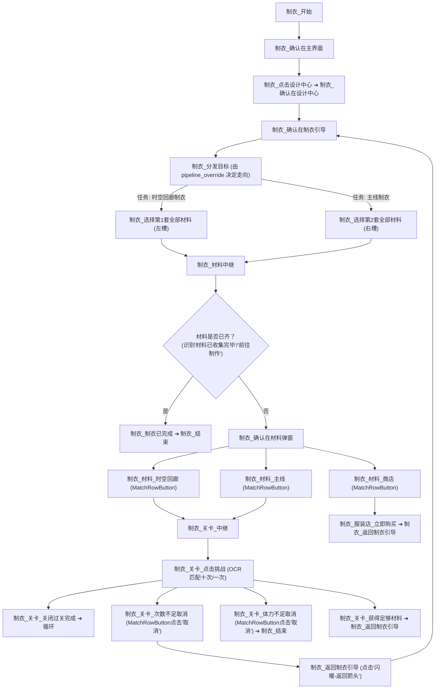
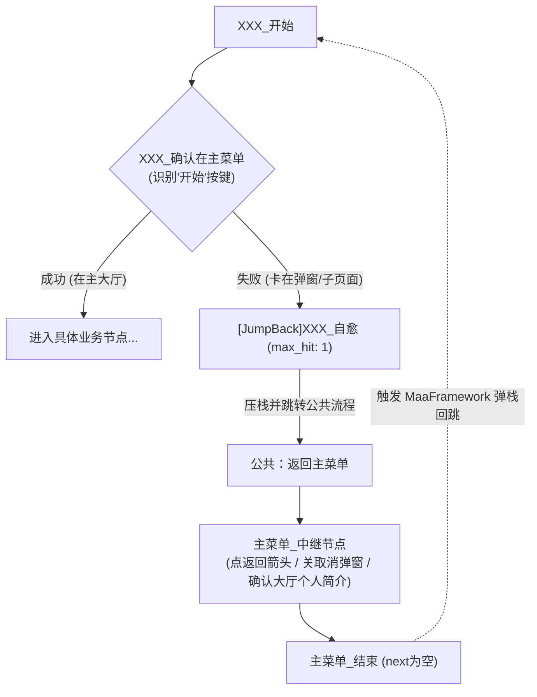

# MaNikki4 任务流水线全景与节点字典

本文档记录了 `assets/resource/pipeline/` 下所有任务流水线（Pipelines）的组织结构、入口节点、控制流转与配置参数覆盖规则。

---

## 1. 任务映射总表

| 任务标识（Name） | 界面显示名称（Label） | 入口节点（Entry） | 关联流水线文件 | 核心配置项（Options） |
| :--- | :--- | :--- | :--- | :--- |
| `__MXU_PRETASK__...` | **🎮 启动模拟器与游戏** | `登陆游戏` | *(由 Go Agent 执行)* | `MuMuConfig`（模拟器路径） |
| `登陆游戏` | **🚀 登陆游戏** | `登陆游戏` | `登陆游戏.json` | - |
| `送礼` | **💌 送礼** | `送礼_开始` | `送礼.json` | - |
| `组队本` | **👥 组队本** | `结伴_开始` | `组队本.json` | - |
| `竞技场` | **⚔️ 竞技场** | `竞技场_开始` | `竞技场.json` | - |
| `抽卡` | **🚪 抽卡** | `抽卡_开始` | `抽卡.json` | - |
| `联盟任务` | **🏛️ 联盟任务** | `联盟_开始` | `联盟任务.json` | - |
| `忆海心阶` | **🌊 忆海心阶** | `忆海_开始` | `忆海心阶.json` | - |
| `美甲` | **💅 美甲店铺** | `美甲_开始` | `美甲.json` | - |
| `分享` | **💎 独立分享** | `分享_开始` | `分享.json` | `ShareAppOption`（分享平台自选） |
| `评选赛` | **🏆 搭配评选赛** | `评选赛_开始` | `评选赛.json` | - |
| `时空回廊制衣` | **👗 时空回廊制衣** | `制衣_开始` | `制衣.json` | `ShikongMainStageOption`、`StoreOption` |
| `主线制衣` | **🧵 主线制衣** | `制衣_开始` | `制衣.json` | `StoreOption` |
| `任务` | **📋 任务奖励** | `任务_开始` | `任务.json` | - |
| `退出模拟器` | **🛑 退出模拟器** | `退出模拟器` | `公共流程.json` | - |

---

## 2. 关键任务核心流转与实现机制

### 2.1 制衣模块 (`制衣.json`)
制衣模块采用高度复用的状态机架构，同时服务于【时空回廊制衣】与【主线制衣】：

#### 制衣关键配置覆盖 (Pipeline Override)
* **时空回廊任务**：
  * 将 `制衣_分发目标` 的 `next` 覆盖为 `["制衣_选择第1套全部材料"]`；
  * `ShikongMainStageOption` 开关关闭时（默认），禁用 `制衣_材料_主线` 节点，并将 `制衣_关卡_次数不足取消` 后的分支直接指向 `制衣_时空回廊直接结束`，从而保护日常体力。
* **主线制衣任务**：
  * 将 `制衣_分发目标` 的 `next` 覆盖为 `["制衣_选择第2套全部材料"]`。
* **商店材料开关 (`StoreOption`)**：
  * 关闭时，将 `制衣_材料_商店` 的关键词置为 `__DISABLED__`，跳过进店购买。

---

### 2.2 独立分享模块 (`分享.json`)
* **支持目标平台**：通过 `ShareAppOption` 选项动态切换分享目标应用，包括：
  * `QQ`（默认）
  * `微信`（WeChat）
  * `微博`（Weibo）
  * `小红书`（Xiaohongshu）
* **APP 自愈与拉回机制**：
  * 点击分享到外部社交 APP 后，系统会唤起对应 Android 应用。
  * 脚本内置自愈节点，在检测到离开游戏或到达分享界面后，自动触发 Android Back 键或重新切回《闪耀暖暖》，回到游戏主界面领取粉钻奖励。

---

### 2.3 竞技场模块 (`竞技场.json`)
* **自动穿戴顶配**：周常或日常首次进入时，自动触发“推荐搭配”并点击确定保存当前当周最高分套装。
* **智能挑选对手**：
  * 配合 Go Agent 的 `arena/checker.go` 模块，通过 OCR 扫描三个候选对手的防守战力与玩家自身进攻战力。
  * 若存在低于自身战力的对手，点击该对手发起挑战；
  * 若三个对手战力均过高，自动点击金币“换一批”，直至找到可碾压对手或达到换人上限。

---

### 2.4 组队本模块 (`组队本.json`)
涵盖游戏内三大常驻每日副本次数清空：
1. **不落的帷幕**：自动选择当前开启的幕次（或最高难度），进入快速组队，匹配完成后执行自动战斗与结算。
2. **印象航旅**：选择“虚渊·险”或其他可用难度，执行快速组队与扫荡。
3. **时光钟表铺**：自动点击可用关卡，快速组队清空每日次数。

---

### 2.5 送礼与家园 (`送礼.json`)
1. **好友送心**：进入好友列表，点击“一键赠送并领取”爱心与体力。
2. **暖暖家园**：
   * 进入暖暖的家，检测并赠送小礼物；
   * 点击零食采购，补充活力值与好感度。

---

### 2.6 联盟任务 (`联盟任务.json`)
1. **联盟捐献**：自动执行每日金币捐献。
2. **机密关卡**：进入当前开启的机密关卡，自动扫荡满每日 5 次免费挑战。
3. **联盟福利**：自动领取今日联盟红包与每周/每日采购物资补给。

---

### 2.7 忆海心阶 (`忆海心阶.json`)
* 进入心阶主页，识别当前推进阶段；
* 自动配置最高加成概念与灵感套装，推进挑战；
* 挑战完成或扫荡完毕后返回，完成日常结算。

---

### 2.8 美甲店铺 (`美甲.json`)
* 进入美甲商城与我的美甲店；
* 自动雇佣当日店员打理店铺；
* 一键提取离线营业金币与美甲积分收益。

---

### 2.9 搭配评选赛 (`评选赛.json`)
* 主界面点击“开始” ➔ 进入“搭配评选赛”主页；
* 检查剩余点赞次数：
  * 若“剩余推送次数：0次”，判定次数不足，直接触发 `公共：返回主菜单`；
  * 若有次数，点击“我当评委”进入评选界面，循环点击“赞”进行评选投票；
* 投票过程中若检测到次数耗尽（“0次”），自动调用 `公共：返回主菜单` 安全退出。

---

### 2.10 任务结算 (`任务.json`)
* 日常所有任务跑完后，最后进入【每日任务】面板；
* 点击“一键领取”所有活跃度宝箱（满 120 活跃），拿齐每日全部免费粉钻与体力奖励。

---

### 2.11 公共导航与退出 (`公共流程.json`)
* 提供通用子图节点 `公共：返回主菜单`：
  * 持续查找并点击 `闪暖-返回箭头.png`，直到画面出现底部“开始”或“设计中心”等主大厅标志，实现无论身处哪级多级子页面均能可靠安全归位。
  * 既用于各任务正常跑完时的收尾退出，也用于入口异常自愈的调用归位。
* 提供 `退出模拟器` 任务：优雅向 MuMu 模拟器发送关闭信号，释放电脑内存。

---

### 2.12 任务入口通用自愈机制 (`[JumpBack]` 与 `公共：返回主菜单`)

为防止前置任务遗留的子页面、偶发活动弹窗导致后续任务因“未在主界面”直接失败，所有日常任务（除登录与开关模拟器外）均在入口实现了标准化的自愈闭环：

#### 设计规范与准则：
1. **防死锁限制**：各任务的 `XXX_自愈` 节点必须配置 `"max_hit": 1`，若自愈一次后仍无法恢复大厅，自动中断防止无限循环。
2. **MPE 画布分身排布 (`extra_positions`)**：
   * 在同一个画布中，入口自愈与尾部退出均统一连接 `公共：返回主菜单`；
   * 为彻底消除横跨画布的穿屏长线，利用 MPE 的 `extra_positions` 机制在入口自愈节点旁放置外部节点分身（例如在 `$__mpe_external_公共：返回主菜单_XXX` 中配置 `extra_positions` 位于自愈节点右侧），连线就近闭环，画布清爽优雅。
